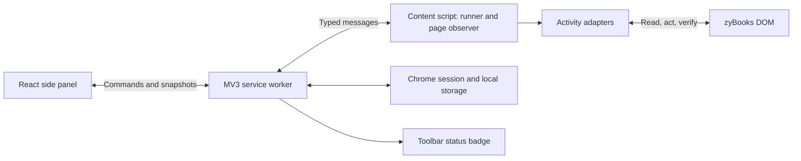

# Better ZyBooks Auto: implementation plan

Prepared September 13, 2026. Companion documents: [source audit](RESEARCH.md) and [build prompt](BUILD_PROMPT.md).

## Product decision

Build a Chrome Manifest V3 extension, provisionally called **ZyFlow**, that automates supported participation activities while showing its current action, verified progress, and anything needing attention. The working name needs an availability check before publication.

Use a persistent side panel, a single cancellable runner per tab, and separate adapters for each activity family. Start with deterministic DOM interaction. No paid API, application server, external database, or AI subscription is required for the initial version.

The original supports short answers in code but implements them unreliably; drag-and-drop has no implementation. Its navigation and lifecycle problems are confirmed in [the audit](RESEARCH.md). A fresh implementation is preferable to layering new UI over those loops.

## Scope and user experience

Initial target: current desktop Chrome, English-language zyBooks participation activities. Start from one section with optional continuation over an explicitly selected section range. Support other languages, browsers, and activity families only after testing them.

The user opens the panel, sees the connected book/section and a scan summary, chooses activity types and run scope, and clicks Start. The panel acknowledges the request immediately, then shows the runner's actual state. Pause, Resume, Stop, Retry item, Skip item, and Show on page remain understandable throughout a run.

A sample status view:

```text
ZyFlow                        Connected · Section 2.3
Running                       Updated just now
12 of 18 activities verified complete
3 already complete · 9 completed this run
1 needs attention · 5 queued

Current: Short answer · Question 2 of 4
Waiting for zyBooks completion indicator…

[Pause] [Stop]

Activity list
✓ Animation 2.3.1              Completed
✓ Multiple choice 2.3.2        Already complete
! Code blocks 2.3.3            Interaction unsupported
```

The example counts are illustrative. Activities and questions have separate counters; neither is labeled “assignment grade.” A run that skips work ends as “Finished with 1 skipped,” not “100% complete.”

UI requirements:

- A main status line with idle, scanning, running, waiting, paused, needs attention, navigating, finished, and error states.
- Acknowledgement of clicks within a target 150ms under normal conditions; backend/content acknowledgement has a timeout and visible failure state. A button press alone must never imply execution started.
- Current activity, last meaningful progress time, and reason for waiting. A heartbeat shows the agent is connected; it is separate from activity progress so a stuck loop cannot look productive.
- Per-activity outcomes and structured explanations such as “Answer field not found” or “Navigation did not reach section 2.4.” Technical details go in expandable diagnostics.
- Visible focus states, keyboard operation, accessible labels, status announcements, reduced-motion support, and status indicators that do not rely only on color.
- Light/dark system theme, consistent spacing and typography, restrained movement, and bundled assets. CSS variables/CSS modules are sufficient.
- A small toolbar badge for running, paused, attention, or disconnected. Closing the panel does not stop the content runner; reopening reconstructs the current state.
- No login form: use the session already open in the zyBooks tab. Other tabs show “Open a zyBooks section” or “Connect to this tab.” Switching tabs must never silently retarget an active run.

## Activity support and feasibility

| Family | Planned method | Completion evidence | Delivery gate |
| --- | --- | --- | --- |
| Animations | Detect each animation's current state; enable an available speed control only if needed; advance when the UI permits it. | That activity's documented completion indicator. | Current fixture plus live smoke check; no fixed global playback loop. |
| Single-choice participation questions | Work within one question. Use available revealed answer information; otherwise try a bounded sequence of remaining choices, waiting for fresh correctness feedback after each. Stop on success. | Question completion/correctness followed by set completion as appropriate. | Confirm this family is participation, not a challenge or assessment. Do not generalize radio handling to all inputs. |
| Short answer / fill in the blank | Map each field to its question; use the ordinary reveal UI if available; parse the revealed value according to the field type; set the value through the supported input path and submit once. | Fresh question feedback and completion marker. | Test input, textarea, multi-field, code text, numeric format, multiple accepted answers, and absent reveal states separately. |
| Term/definition matching | Identify stable source and target IDs; use explicit revealed mapping if available, or bounded matching attempts where the activity exposes feedback. Verify each placement. | Correct placement plus whole-activity completion. | Prove the extension's real event mechanism works with the widget. |
| Ordered blocks / Parsons-style code | Model order, indentation, optional blocks, and duplicates separately. Use a structured solution from visible reveal information, a user-supplied arrangement, or a later reasoning provider. | Accepted order/indentation and final completion. | Independent discovery and prototype; never claim support based on term-matching success. |
| Unknown activities, multi-select, challenges, labs, assessments | Detect and label clearly; leave out of the initial automation scope. | Report unsupported/out of scope, not complete. | Each additional family requires its own adapter and fixtures. |

“Fill in the blank” is not one universal widget. Do not pair document-wide lists by index, copy answer HTML into a text box, join alternate accepted answers with “or,” or trim code whitespace indiscriminately. Native value setters plus the widget's required input/change events are candidates to validate, not a universal guarantee. Reacquire fields after rerenders.

Drag feasibility has two distinct problems: deciding where a block belongs and causing the page to accept the move. A language model may help with the former; it does not solve the latter. Start by inspecting whether the widget offers click-to-place or keyboard movement. Otherwise prototype the actual HTML drag/drop or pointer event path using the extension itself. Programmatically dispatched events are untrusted, so acceptance is widget-dependent. [DOM event trust](https://developer.mozilla.org/en-US/docs/Web/API/Event/isTrusted)

For matching, cap attempts at the number of distinct source-target pairs and stop if an action makes no detectable progress. Do not brute-force permutations for code ordering: the search grows too quickly and correctness may depend on indentation or unused blocks. Unsupported interactions remain visible and skippable.

## Architecture



**Content script:** owns live DOM discovery, one serial activity queue, short waits, and cancellable execution for its document. Uses an isolated world and narrow selectors scoped to an activity root. A bounded observer watches relevant changes; selectors live in versioned adapter modules. Chrome content scripts share DOM access but not ordinary JavaScript variables with the page. [Content script model](https://developer.chrome.com/docs/extensions/develop/concepts/content-scripts)

**Service worker:** routes commands, records checkpoints, receives navigation events, updates badges, and coordinates document ownership. Register listeners synchronously at module startup. Never depend on a forever-running service worker, global variables surviving restart, or a worker timer driving the activity loop. [Service worker lifecycle](https://developer.chrome.com/docs/extensions/develop/concepts/service-workers)

**Side panel:** renders state and sends commands. It does not own automation. The API is available in MV3 from Chrome 114; `sidePanel.open()` requires Chrome 116 and a user gesture. Set a technical minimum of 116 if using it; claim actual support only for browser versions covered by validation. [Side Panel API](https://developer.chrome.com/docs/extensions/reference/api/sidePanel)

**Persistence:** `storage.session` holds run ownership and checkpoints across worker restarts and document changes within the browser session. The worker brokers access because session storage is not exposed to content scripts by default. `storage.local` holds preferences and bounded redacted diagnostics. Session storage is cleared on browser restart/extension reload or update; after that, scan again and require a new Start. Avoid persisting question text or answers by default. [Storage API](https://developer.chrome.com/docs/extensions/reference/api/storage)

### Execution model

Run states: `idle → scanning → running ↔ waiting → navigating → scanning → finished`, with explicit `paused`, `stopped`, `needs_attention`, and `error` transitions. `finished` carries an outcome summary and can include skipped work.

Per-item states: `queued`, `already_complete`, `running`, `waiting`, `complete`, `needs_attention`, `skipped`, `unsupported`, `failed`.

Every action follows **observe → validate → act once → await fresh evidence → checkpoint**. A missing completion marker means unknown/incomplete. Zero detected activities means empty or unrecognized, and never automatically means success.

Suggested contracts, refined after discovery:

```ts
type ActivityKind = 'animation' | 'single_choice' | 'short_answer'
  | 'matching' | 'ordered_blocks' | 'unknown';

interface ActivityAdapter {
  kind: ActivityKind;
  detect(root: Element): Detection;
  inspect(ref: ActivityRef): Promise<ActivitySnapshot>;
  nextAction(snapshot: ActivitySnapshot): ActionPlan | null;
  execute(action: ActionPlan, context: RunContext): Promise<ActionResult>;
  verify(ref: ActivityRef, before: ActivitySnapshot,
    signal: AbortSignal): Promise<Verification>;
}
```

`ActivityRef` uses a stable site identifier when present, or a documented fallback fingerprint from structure/content. It is never just an index into a global node list. `Verification` includes the observed evidence, timestamp, and scope. A content hash change invalidates a prior plan.

Each command carries `protocolVersion`, `requestId`, `runId`, and expected tab/document identity. Each event carries a monotonic sequence number. Validate messages at runtime and reject stale document/run commands. Check message sender origin, extension identity, and frame/tab ownership; do not expose an arbitrary page-to-extension action bridge. Chrome messaging serializes data, so exchange serializable objects rather than DOM nodes or class instances. [Messaging documentation](https://developer.chrome.com/docs/extensions/develop/concepts/messaging)

Use one runner lock per tab and one generation token per document/route. Start is idempotent. Pause/Stop cancels future work through `AbortController`, observer cleanup, and generation checks immediately before each mutation. An action already dispatched cannot be undone; verify its outcome before deciding whether to retry after resumption. Default to one active run across tabs in v1 for simpler user control.

Use condition-based waits, debounced `MutationObserver` notifications, and a bounded polling fallback. Give every wait a deadline. Use a progress signature to detect stalls. Never add endless retry loops or assume a successful `.click()` means a completed action. Pause hidden tabs by default in v1; handle frozen/discarded tabs and reconnection explicitly rather than promising uninterrupted background execution.

### Reliable next-section flow

1. Verify that the selected work is terminal. Default: stop on unsupported or failed work; an explicit Skip allows continuing with that work recorded as skipped.
2. Read the actual visible next-section link and validate its destination against the chosen book and section-range boundary. Do not manufacture the URL by incrementing a number.
3. Persist the expected destination, current checkpoint, and navigation token; await persistence before clicking.
4. Cancel the old page's active operations, enter `navigating`, and perform one navigation action.
5. Observe history updates and full navigation through `webNavigation`, filtered to the zyBooks origin and top-level frame. Route events indicate navigation, not DOM readiness. [Web Navigation API](https://developer.chrome.com/docs/extensions/reference/api/webNavigation)
6. Wait for the expected route identity plus the new section root/loading state. A changed URL with stale content does not pass. An unchanged document ID on a client-side route still needs a new runner generation.
7. The new/reconnected content script claims the persisted run only if tab, book, expected destination, and navigation token match. It scans before resuming and never blindly replays an in-flight action.
8. Use a visited set and maximum section count. A missing next link at the expected end is a normal finish; an unexpected missing/disabled link is a needs-attention state. Login redirects, manual navigation, and navigation outside scope pause the run.

An empty section can be skipped only after a positive loaded-section identification and explicit run policy; a selector failure stays unrecognized. Show section completion based on zyBooks indicators, and label LMS submission status as unknown unless separately visible. Preserve the site's existing LMS entry context.

## Technologies, APIs, and prerequisites

### Recommended tools

| Tool | Role | Requirement |
| --- | --- | --- |
| TypeScript | Shared types, adapters, runner, messages | Core |
| WXT with its React template | Extension entry points, build, development reload, packaging; uses Vite underneath | Core recommendation; do not configure an unrelated second Vite build. [WXT setup](https://wxt.dev/guide/installation.html) |
| React + React DOM | Side-panel components and state rendering | Core recommendation; native CSS/modules for styling |
| Node.js 24 LTS + npm | Development and locked dependency installation | Core recommendation as of research date. [Node release schedule](https://nodejs.org/en/about/previous-releases) |
| Zod | Runtime validation of messages, settings, persisted state; inferred TS types | Core recommendation. [Zod](https://zod.dev/) |
| Vitest + jsdom | Reducer, cancellation, detection, extraction, navigation contract tests | Development only. [Vitest guide](https://vitest.dev/guide/) |
| Playwright Test + bundled Chromium | Built-extension tests in a persistent browser profile | Development only. [Extension testing](https://playwright.dev/docs/chrome-extensions) |
| TypeScript compiler, ESLint, Prettier | Type checks and consistent code | Development only |
| Git + a CI runner, e.g. GitHub Actions | Version history, checks, release ZIP artifacts | Recommended; cloud repo optional for a local prototype |
| Chrome DevTools | Inspect actual activity DOM and extension/service-worker failures | Required for integration discovery |

Pin mutually compatible versions in the lockfile at project creation; use exact installed versions in release documentation. React local state plus a runner reducer is sufficient initially. Redux, a separate state-machine library, Tailwind, and a component kit are optional, not prerequisites.

### Browser APIs and permissions

| API/access | Purpose | Manifest treatment |
| --- | --- | --- |
| `chrome.sidePanel` | Persistent control UI | `sidePanel` permission, `side_panel` entry, toolbar action opens panel |
| `chrome.runtime` messaging | Commands, acknowledgements, snapshots | No separate runtime permission |
| `chrome.tabs.query/sendMessage`, tab lifecycle events | Pin actions to the intended tab and detect closure/change | Most tab methods need no broad `tabs` permission. Use the exact zyBooks host permission for matching tab metadata. [Tabs API permissions](https://developer.chrome.com/docs/extensions/reference/api/tabs) |
| `chrome.storage.local/session` | Preferences, checkpoints, bounded logs | `storage` permission |
| `chrome.action` | Badge text/color, action entry point | `action` manifest entry; no separate action permission |
| `chrome.webNavigation` | Full navigation and History API updates | `webNavigation` permission; strict host/frame filtering |
| Static content script | Discover and interact with zyBooks activities | `content_scripts.matches: ["https://learn.zybooks.com/*"]`; perform section/type checks before actions |
| Exact host access | Matching tab metadata and scoped integration | `host_permissions: ["https://learn.zybooks.com/*"]` |
| DOM APIs | Query selectors, `MutationObserver`, `AbortController`, input/drag/pointer events, `URL`, `crypto.randomUUID` | No additional extension permission; validate actual widget behavior |

No initial `cookies`, `debugger`, `webRequest`, `scripting`, `<all_urls>`, or `unlimitedStorage` permissions are needed for this architecture. `activeTab` plus programmatic injection is an alternative permission model, not an additional requirement. Add an API only when a concrete implemented feature requires it.

**External APIs:** none required for animations, revealed-answer entry, observable MCQ feedback, supported matching, UI, or navigation. No official zyBooks activity API is assumed. Playwright is a testing tool here, not something shipped inside the extension to control the user's browser.

### Optional reasoning layer

Only add a hosted model API if the current widgets require reasoning that visible answers or deterministic handling cannot supply, especially ordered code blocks. Keep an `AnswerProvider` interface separate from the interaction adapter. Input contains only the necessary prompt, constraints, block IDs, and allowed targets; output is validated structured data such as field values or block order/indentation. Reject missing/duplicate IDs, invalid targets, stale content, and invalid schemas. Never execute model-generated JavaScript.

A hosted model requires a provider account, usage budget, server-side key storage, a small HTTPS backend with authentication and request limits, and a clear user control for sending activity content. Do not embed a shared paid API key in the extension. Provider choice and model accuracy need a representative evaluation; this audit does not establish a model recommendation or price. A local model is another possibility but adds installation and compatibility work.

AI is not on the critical path for the first release. Public answer revelation and supported DOM actions can operate entirely locally. Universal code-block solving is a separate feature with uncertain accuracy and interaction coverage.

### Other things needed

- Access to representative current zyBooks sections, including actual fill-in and block activities. This is the main missing implementation input.
- A compatibility inventory: family, book/context, observed widget structure, evidence of completion, frame/shadow-root behavior, and date last tested.
- Sanitized DOM fixtures and synthetic questions that exercise the same behavior without committing accounts, tokens, answers, or textbook pages to a public repository.
- Extension icons, store screenshots, a short description, support contact, and privacy disclosures matching the implemented data flow.
- A Chrome Web Store developer account if publishing; Google documents a one-time registration fee. Verify the payable amount during registration rather than budgeting from an old blog. [Registration](https://developer.chrome.com/docs/webstore/register)
- Reviewable release ZIP, test instructions/demo for review, and release notes. Store publication requires submission and review; acceptance and review duration are not guaranteed. [Publishing workflow](https://developer.chrome.com/docs/webstore/publish)
- Bundle executable logic in the extension. Remote configuration/model responses must remain data, not downloadable code. [Manifest V3 requirements](https://developer.chrome.com/docs/webstore/program-policies/mv3-requirements)

## Implementation phases and acceptance gates

These are rough planning estimates for one experienced developer with representative site access, not delivery commitments. Drag interactions and access to examples are the largest uncertainty.

| Phase | Deliverable | Exit criteria | Estimate |
| --- | --- | --- | --- |
| 0. Discovery | Read-only inspector, compatibility matrix, sanitized fixtures, drag proof of concept | Evidence for actual selectors/IDs, completion, routing, and one example per requested family; unknowns recorded | 2–4 days |
| 1. Foundation | WXT project, panel, typed protocol, reducer, observer, checkpoints, cancellation | Start deduplication, live acknowledgements, stop/pause behavior, reconnect, mock activity ledger | 3–5 days |
| 2. Core adapters | Animations, MCQ, and short answers on one section | Correct per-item mapping and completion verification; no document-wide action loops | 4–7 days |
| 3. Navigation | Scoped multi-section runs, full/SPA handoff, destination verification | Slow loads, empty sections, final section, manual route changes, reloads pass | 2–4 days |
| 4. Blocks | Matching adapter; separately gated ordered-block adapter | Extension-origin interaction demonstrated; bounded retries; duplicates/indentation handled or explicitly unsupported | 4–10+ days |
| 5. Release hardening | Real-book smoke checks, diagnostics, UI polish, package | Supported-family evidence and release checks complete | 3–5 days |

Roughly 18–35+ working days for the full sequence. An initial useful beta can ship after phases 0–3; it must label block support accurately. If phase 0 finds a widget cannot be reliably manipulated through supported DOM interactions, record that limitation and retain manual handoff instead of advertising completion.

### Required validation

1. Double-click Start and reopen the panel: exactly one runner; state and progress remain correct.
2. Pause/Stop during every kind of pending wait: no later action can fire from an obsolete generation. Already-dispatched actions are not misreported as undone.
3. Delay feedback and rerender activity roots: no premature completion, stale-node actions, or duplicate submissions. An ambiguous prior submission is observed before retry.
4. Revisit already completed questions with blank inputs: completion remains correct from site markers.
5. Missing selectors, changed markup, empty/loading pages, and unknown activity families: no false success or unintended next navigation.
6. Short answers with multiple fields, alternate accepted values, code whitespace, entities, and differing DOM order: answers stay with their own questions.
7. Multiple-choice success before the final option: remaining choices are not clicked. Challenge and unrelated radio controls are untouched.
8. Matching and ordered blocks: correct logical plan plus accepted interaction. Test the extension's event dispatch by invoking its actual adapter; Playwright's `dragTo()` success alone does not prove the extension works.
9. SPA and full navigation, end-of-book, disabled next link, browser back, login redirect, manual navigation, tab closure/discard, and worker restart: checkpoints reconcile without duplicate actions.
10. Offline/slow feedback: stale or missing evidence becomes needs attention, never an invented server-save claim.
11. Keyboard navigation, visible focus, contrast, reduced motion, and status announcements pass manual UI checks.
12. Packaged build loads in Chrome without worker errors; production manifest has only intended permissions and no localhost test matches.

Automated extension tests should use Playwright's bundled Chromium with a persistent context, as its documentation specifies. Use a dedicated development/test manifest for localhost fixtures; never ship that access in the release manifest. Test the built extension and then perform a small real Chrome smoke check. Keep DevTools closed during worker-suspension validation so inspection does not mask lifecycle behavior. [Playwright extension guidance](https://playwright.dev/docs/chrome-extensions)

## Suggested project layout

```text
entrypoints/
  background.ts
  content.ts
  sidepanel/index.html
  sidepanel/main.tsx
  sidepanel/App.tsx
src/
  core/             # reducer, queue, cancellation, retry policy
  protocol/         # schemas, commands, events, versioning
  adapters/         # registry and individual activity families
  navigation/       # route identity, scope, handoff, readiness
  storage/          # versioned settings/checkpoints
  diagnostics/      # redacted event ring buffer and export
  ui/               # components, styles, accessibility helpers
tests/
  fixtures/
  unit/
  extension/
docs/
  compatibility.md
  architecture.md
  release.md
wxt.config.ts
```

Completion of the project means a usable packaged extension plus evidence for its declared support, not just a polished panel. Maintain a dated compatibility matrix and add a fixture when a real site change breaks an adapter. The durable advantage is that failures become visible, bounded, and fixable.
