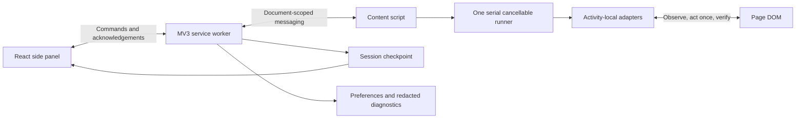

# Architecture

ZyFlow uses WXT, TypeScript, React, native CSS and Zod. The source is a Chrome extension, not a standalone web application. Executable assets are bundled locally.

## Ownership and protocol

The content script owns DOM observation and execution. The panel only submits commands and reads snapshots; closing it does not destroy the runner. The worker brokers all session access and pins the run to one tab. Its listeners register synchronously. Ownership/checkpoint mutations and preference writes are serialized; command forwarding remains outside that queue so content acknowledgements can checkpoint without deadlocking the worker.

Protocol version, request ID, run ID, tab ID, browser-authoritative document ID, route and monotonic snapshot sequence are validated. Commands are accepted only from this extension’s side-panel URL. Content messages must come from this extension’s allowed host, top-level frame and browser-assigned document identity. No external message listener or page-to-extension bridge exists. Delayed sequence numbers, obsolete documents and stale run commands are rejected.

`storage.session` holds the current checkpoint across worker restarts. Preferences and an allowlisted ring of at most 100 redacted state reports use `storage.local`. Export includes at most 200 anonymous activity outcomes. Session state disappears on browser restart/extension reload; the content script creates an idle session requiring a new Start. No worker timer drives the activity loop. Content heartbeat updates are distinct from meaningful progress and can wake a suspended worker.

If the original document is gone or unreachable, Stop revokes its run ID in a session-only ring of at most 50 IDs before publishing the stopped checkpoint. Late checkpoints cannot resurrect the run. A reconnect creates a fresh stopped identity and requires an explicit Start. Completed and stopped states remain terminal on reconnect.

## Execution

The reducer validates run-state transitions. The runner owns a single task, `AbortController` and generation. Start is idempotent while running, paused or awaiting attention. Content commands are serialized. Pause/Stop increment the generation and abort observers and timers. Context validation immediately precedes every mutation and rejects a changed route, detached root, changed fingerprint or cancelled generation.

Each action inspects a fresh root, builds a bounded plan, persists an uncertain-action marker, acts once, observes fresh evidence, and checkpoints progress. A click alone is never completion. Missing controls, unsupported states, timeouts, empty scans and missing completion markers produce attention. The marker is written **before** mutation: a crash in that small window can conservatively require manual inspection even if no click occurred. This favors avoiding replay.

Pause/resume in the same document reconciles in-flight feedback before another action. A new document with a persisted uncertain marker requires positive activity completion or explicit Skip; it cannot safely replay the old submission. A browser restart clears the session and requires a new Start/rescan. Already-complete activities use DOM completion markers even if fields are blank.

Waits use MutationObserver plus a bounded polling fallback and a deadline. Every success, timeout, exception or abort disconnects the observer and clears timers. Activity action counts bound work; MCQ also bounds choices. Matching uses one visible mapping per source; ordered blocks require a structured arrangement, unique IDs, valid indentation and explicit distractors.

## Navigation

Default scope is one section. A selected range has an end section and maximum of 20 sections. Next is considered only after a nonempty current queue is complete, already complete or explicitly skipped. The actual visible enabled link must stay in the same book/origin, move forward, remain within the boundary and avoid visited routes. Its existing query parameters are retained.

The worker persists a destination, token and timestamp before the content script cancels its generation and clicks once. Full-navigation and History API events notify the content script. Reconnection requires the same tab and a matching unexpired destination/token. The new runner waits for the correct section root and explicit readiness before scanning. Manual navigation pauses. A missing or unsuccessful destination cannot count as completion. A navigation watchdog reports attention/paused state if the expected route never arrives.

## Integration boundary

The production registry currently offers read-only historical candidate detection. All executable family adapters are fixture-gated pending live evidence. This is intentional and visible in the panel. See `compatibility.md` for the separate delivery gates, known unsupported variants and required current examples.

Official implementation references: [WXT entrypoints](https://wxt.dev/guide/essentials/entrypoints.html), [Chrome sidePanel](https://developer.chrome.com/docs/extensions/reference/api/sidePanel), [Playwright extension testing](https://playwright.dev/docs/chrome-extensions). Checked during setup on September 13, 2026.
